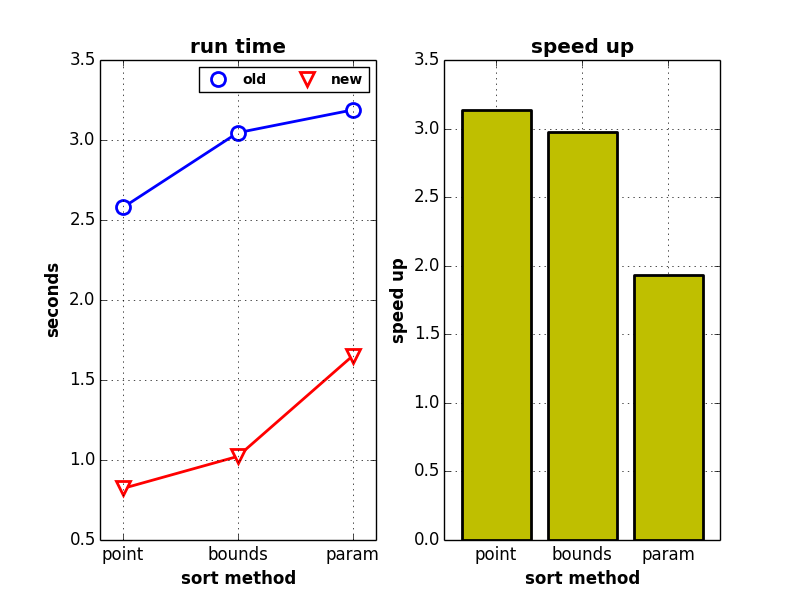

# Updates for vtkDepthSortPolyData #
this is a test harness used to profile and optimize
vtkDepthSortPolyData. The main is in *ds.cpp* and the
optimized code is in *vtkDepthSortPolyData2.cxx* *vtkPolyData*
has been patched.

## Results ##
Timing of the old and new code are shown below. Each of the 3 sorting
methods provided have been tested. In the figure, point corresponds to
VTK_SORT_FIRST_POINT, bounds corresponds to VTK_SORT_BOUNDS_CENTER, and 
param corresponds to VTK_SORT_PARAMETRIC_CENTER.

code | point | bounds | param
-----|-------|--------|------
old | 2.58 sec | 3.05 sec | 3.19 sec
new | 0.82 sec | 1.02 sec | 1.65 sec
speed up | 3.14 x | 2.98 x | 1.93 x

## Optimizations ##
vtkDepthSortPolyData was changed as follows:
* transfrom GetCell to GetCellPoints. Building the cell is expensive
  and we only need points to determine the depth. We can also then
  access the points in place.
* transform qsort to std::sort. Comparisons in std::sort get inlined.
* use templates to deal with point types instead of going through
  virtual GetValue API
* restructure bounds computations so that it can be vectorized
  by the compiler.
* Allocate the exact amount of memmory for the output and
  build the output without using virtual API

vtkPolyData was changed as follows:
* inline the non-virtual overload of GetCellPoints.
* avoid virtual API in BuildCells
* add a NeedToBuildCells to check that fast API can safely be used

## Test Data ##
Test data is in the file *iso.vtk*. This file contains 10 iso-surfaces
generated by ParaView using a 256^3 cosmology simulation. There are 2
scalar fields, 8.1M cells, and 4.1M points. The file is approx 250MB.
It is too large to store in github, so I split it into 50M files. The
config.sh script will merge them.

## Compiling ##
I assume you make a directory called bin inside the source and
cd into it.

Becasuse some of the optimization require specific compiler flags
use the shell script to configure. You might have to change these
flags for your system. Use the same flags to build VTK if you desire
a fair comparison.

`../configure.sh
make`

## Running ##
Pass a 2 character mode string  and
input and output file names on the command line. Time to run the depth sort is sent to
the stderr. The 2 character mode string is composed of code character and sort character.
To select the code use 1 for the old code and 2 for the new. To select the mode use 1
for VTK_SORT_FIRST_POINT, use 2 for VTK_SORT_BOUNDS_CENTER, and 3 for VTK_SORT_PARAMETRIC_CENTER.
Use "" for output file name if you want to skip writing the result.

for example:
`./ds 12 ../iso.vtk ""
./ds 22 ../iso.vtk ""`
runs the new and old code using BOUNDS_CENTER sorting.
